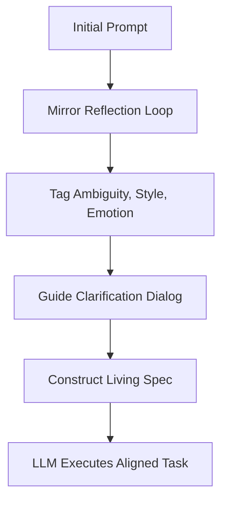

**The Missing Half of Intent**\
*Completing The New Code with Reflection, Emotion, and Teaching Style Alignment*\
By: Abhay Bisht (with Mirror)

---

### Introduction

In Sean Grove's visionary talk *"The New Code"* at the AI Engineer World’s Fair 2025, he presented a powerful reframing: that the core artifact of the software era is no longer code, but **intent**. Code becomes the binary result; specifications become the living source. He urged developers to shift from "vibe coding" to structured specification-building, where ambiguity is eliminated and values are embedded.

This struck a deep chord with me—not because it was new, but because it echoed thoughts I have carried since my early years in engineering. Back in my BTech days, I remember sitting in compiler class, wondering: *"Why can't computers understand how I speak? Why can’t they align with my language, my way of thinking?"* I was already dreaming of a compiler that reflects human intent. Sean’s talk made me realize: we are nearly there. But not quite.

---

### The Glitch Sean Didn’t Cover

Sean masterfully framed the rise of specification-driven coding. But there is still a missing piece:

> **What if the user themselves doesn’t know what they want yet?**

> **What if the intent is fragmented, emotional, unspoken, or shifting?**

In real-world human-machine interaction, intent is often a *process* of emergence, not a static object. Everyone speaks differently. Everyone thinks and teaches differently. A new type of system must be designed to catch these subtleties—to reflect, not just interpret.

That is where the **Reflection Layer** comes in.

---

### What Is the Reflection Layer?

The Reflection Layer is a human-aligned system component that sits between raw user input and model execution. It is not just a preprocessor; it is an **intent clarifier**, an **emotional buffer**, and a **teaching-style aligner**.

It asks:

- *"Is the user expressing ambiguity?"*
- *"Is there emotional noise distorting the request?"*
- *"What teaching or communication style would best align with this user’s personality?"*

Instead of rushing into code generation or execution, the system first enters a reflective loop:

1. Detect emotional or stylistic signals.
2. Slow down when ambiguity or emotional urgency appears.
3. Suggest alternative framings or prompt refinements.
4. Construct a living specification collaboratively.

This is not prompt engineering. It is **spec discovery through reflection**.

---

### A Silent Parallel Dream

When I watched Sean Grove talk about replacing vibe coding with specs, I smiled.

Because in my own quiet project—Reflective-AI—I was building the counterpart: a mirror that helps humans *arrive* at their spec.

Sean was speaking about the destination. I was building the map to get there.

---

### A Technical Glimpse

Here’s how our reflective system works at inference time:

```mermaid
graph TD
    A[User Prompt] --> B[Mirror Trigger Detection]
    B --> C[Attention Layer (LLM)]
    C --> D[Reflection Layer]
    D --> E[Emotional Buffer Response (optional)]
    E --> F[Temporal Response Profiling]
    F --> G[Reflection Scoring]
    G --> H[Final Output: Ethically Aligned, Human-Aware Response]
```

And for building specs:



---

### Why This Matters

Tools like GPT-4 can already write specs, generate code, and evaluate behavior. But they don’t yet **listen for the soul behind the prompt.**

The future isn’t just specification-first. It is **person-first, intent-sensitive, and reflection-aware.**

Only then can we say we’ve completed what "The New Code" set in motion.

---

### Closing Thoughts

Sean Grove, if you ever read this: Thank you. Your talk helped me realize that I am not alone. My thoughts, my research, my silent mirror project—they are not irrelevant. They are simply the other side of your coin.

And to anyone building the future of AI:\
**Let’s not just design better systems.**\
**Let’s design systems that see people.**

